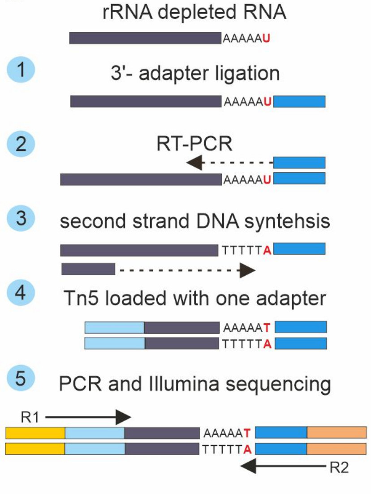

# Pipeline to analyze Genome-wide 3'RACE data (gw-3'RACE)
### Script to analysis of gw-3'RACE data from fastq files.


_Authors: Lidia Lipińska-Zubrycka, Maciej Grochowski, Michał Małecki (Institute of Genetics and Biotechnology, University of Warsaw)_


### gw3’-RACE library preparation
#### Schematic overview of gw-3’RACE protocol:


#### Details:
RNA was extracted from exponentially grown cultures with hot phenol protocol followed by clean-up using Qiagen RNeasy Kit column with DNase I treatment. The rRNA depletion was achieved using a riboPOOL kit (siTOOLs). After depletion, RNA was cleaned-up using MiniElute Cleanup columns (Qiagen), and adenylated 3'-adapter was ligated using T4 RNA ligase 2 (NEB). The reaction product was purified using MiniElute Cleanup (Qiagen), and reverse transcription was performed using Superscript III (Thermo). The product was purified using AMPure beads, and second strand synthesis was performed using  E. coli DNA polymerase, E.coli DNA ligase I, and NEBNext Second Strand Synthesis Buffer. The reaction product was cleaned up using AMPure beads. Double-stranded DNA was fragmented using tagmentase (Tn5) loaded with i5 compatible adapter. Products were cleaned-up using AMPure beads.


## Sequencing Data Analysis Protocol
* Sequencing data were filtered for read pairs where R2 contained a 3'-adapter sequence ligated at the first steps of the library preparation. Low-quality read pairs were removed using fastp.
* Reads R1 and R2 were aligned separately to the genome using the STAR aligner. For R2, settings allowed soft-clipping and maintaining non-aligned reads in the final output (.sam file).
* Following this, uniquely aligned reads were extracted from the R1 alignment file and matched to genomic features, forming a .bed type file, using samtools and bedtools utilities.
* In the next step, R1 read names from the created .bed file were matched with their R2 read mates from the .sam file. A custom table was created containing in each row the R2 CIGAR string, read name, sequence, matched feature from the R1 mate, and R1 and R2 alignment coordinates.
* These raw data tables served as a basis for tail analysis. Information about the tail existence, its length and type were extracted from the tables using a custom Python script.
* The script identified tail sequences from the R2 read based on the CIGAR string and categorized tails as poly(A), poly(A)U, oligo(U), or other using text search (grep regular expressions). If R2 was not aligned and thus a CIGAR string was unavailable, the R2 sequence was scanned using text search to categorize the tail into one of the aforementioned four categories.
* The script output was a .csv type table containing necessary information for downstream data analysis and visualization. The final table contained one row per uniquely aligned R1 read with information about tail type, 3'-end coordinate (where applicable), tail length, number of Us (where applicable), gene name, and distance of detected 3'-end from annotated TES.

## Stages of data analysis

### 0. Preparation of STAR index
The first stage of gw-3'RACE sequencing data analysis is preparing the index. In our script, we use the STAR aligner. Below is an example code for preparing a STAR reference for S. pombe yeast. Please pay attention to the appropriate selection of references, downloading them, and placing them in the appropriate directory to which we will refer later. I suggest creating a genome directory and directing the indexed references there.

```
# Create new directory
mkdir genome/
# Save the reference file in fasta format in the new directory
# Prepare STAR index, an example:
STAR --runMode genomeGenerate --genomeDir genome/ --genomeFastaFiles genome/Schizosaccharomyces_pombe.ASM294v2.dna.toplevel.fa
```


### 1. Preprocessing of data and alignment of reads to the reference genome (script: gw3RACE_processing.sh)

```
How to use:
bash gw3RACE_processing.sh -i raw_data_R1.fastq -I raw_data_R2.fastq -o output_directory

# An example:
bash gw3RACE_processing.sh -i data/Spombe_R1.fastq -I data/Spombe_R2.fastq -o output_Spombe
```

### 2. Joining R1 and R2 reads (script: joining_R1R2.sh)

Prepare annotation file in bed format in the directory 'genome'. Run the script in the directory with the output. 
```
How to use:
cd output_directory/
bash ../joining_R1R2.sh -i R1_Aligned.sortedByCoord.out.bam -I R2_Aligned.out.bam -a ../genome/annotation.bed
cd ..

# An example
cd output_Spombe/
bash ../joining_R1R2.sh -i R1_Aligned.sortedByCoord.out.bam -I R2_Aligned.out.bam -a ../genome/annotation_6k_clean.bed
cd ..
```

### 3. Create genome coverage files in bigwig format (scripts: R1_bed_bigWig.sh, R2_bed_bigWig.sh)
This script allows you to obtain genome coverage files in the bigwig format, which can be visualized in, for example, the IGV software or other coverage data visualization tools. The script generates coverage files separately for R1 and R2 reads. It uses the indexed reference in fasta format (.fa.fai).

Run the script in the directory with the output. 
The input files (except for the reference) were generated in the previous step.


```
# How to use:
cd output_directory/
bash ../R1_bed_bigWig.sh -i R1_Aligned.sortedByCoord.out.bam_sorted_unique.bed -g ../genome/reference.fa.fai 
bash ../R2_bed_bigWig.sh -i R2_Aligned.out.bam  -g ../genome/Schizosaccharomyces_pombe.ASM294v2.dna.toplevel.fa.fai
cd ..

# An example:
cd output_directory/
bash ../R1_bed_bigWig.sh -i R1_Aligned.sortedByCoord.out.bam_sorted_unique.bed -g ../genome/Schizosaccharomyces_pombe.ASM294v2.dna.toplevel.fa.fai 
bash ../R2_bed_bigWig.sh -i R2_Aligned.out.bam  -g ../genome/Schizosaccharomyces_pombe.ASM294v2.dna.toplevel.fa.fai
```

### 4. Analysis of tails using Python script
Input data: output_directory/output_table.tab
Output data: the final table corresponded to a uniquely aligned R1 read and included information about the tail type, 3'-end coordinate (if applicable), tail length, number of Us (if applicable), gene name, and the distance from the detected 3'-end to the annotated TES.
Please open **Analysis_of_tails_gw3RACE.ipynb** in Jupyter notebook. All functions are available in **gw3RACE_functions.py**.


### 5. Optional: Visualization with R
Here you can find a library in R for data visualization (prepared by Maciej Grochowski): 
https://github.com/igib-rna-tails/gw3-RACE_vizualization.
